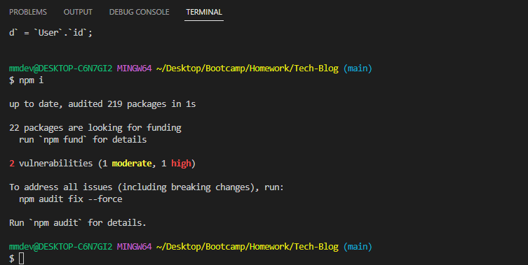
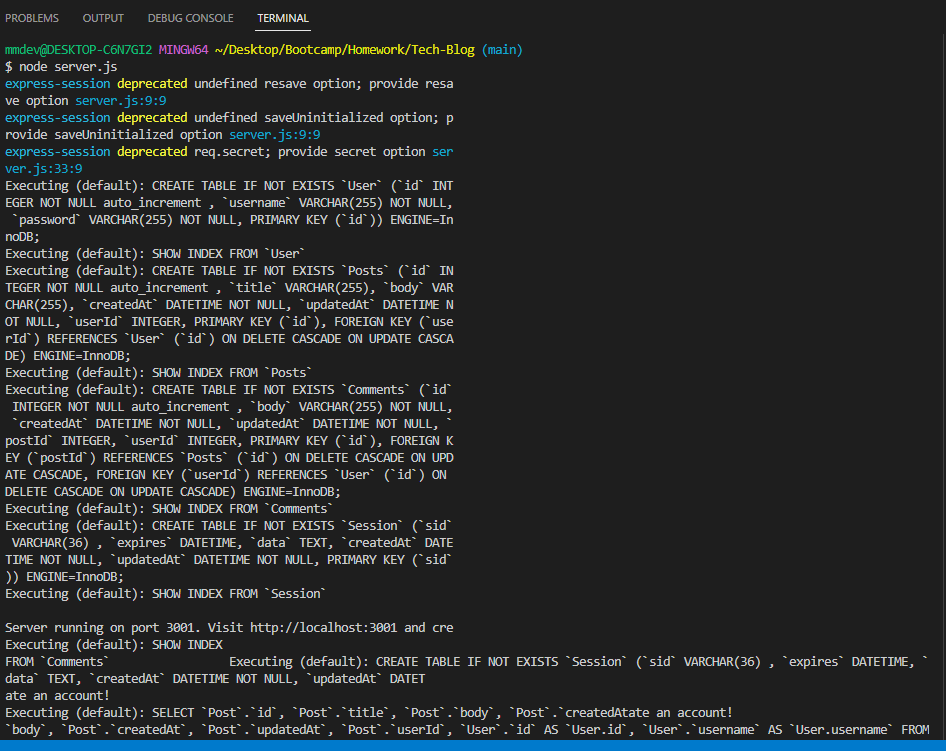
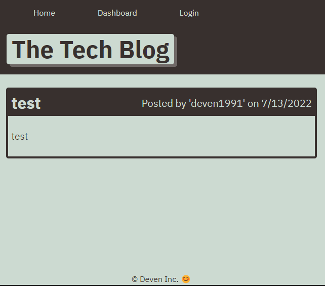
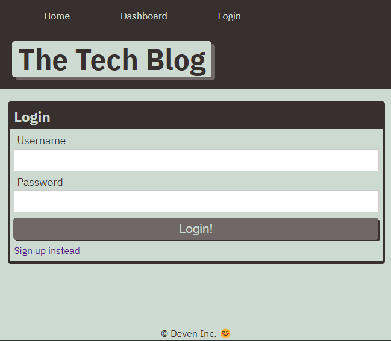
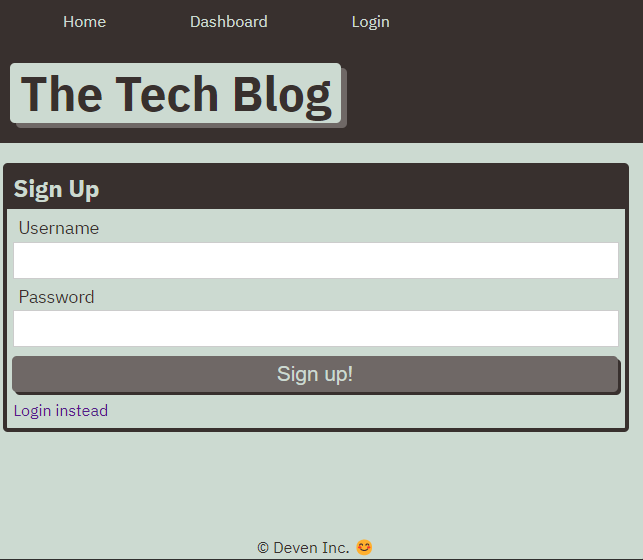

# Tech-Blog

## Description

A CMS-style blog site similar to a Wordpress site, where developers can publish their blog posts and comment on other developers' posts as well. This application is also deployed to Heroku and follows the MVC (Model-View-Controller) paradigm in its archiectural structure.

## Table of Contents 

- [Installation](#installation)
- [Usage](#usage)
- [User Story](#user_story)
- [Features](#features)
- [Links](#links)
- [Questions](#questions)

## Installation

In order to run this application, first run "npm i" in order to install all required packages to run the application. Next, type "node server.js" in the command line in order to start the server. 

NPM Install:

Start Server:

## Usage

When the users visits the site for the first time, he or she is directed to the homepage that includes existing blog posts if any have been posted. The user is presented with navigation links with options to log-in and click on the homepage. On the homepage, the user is prompted to sign-up or sign-in. When prompted to sign-up, user is prompted to set a username and password. When the user clicks on an existing blog post, the user is presented with the post title, contents, post creator's username, and date created for that post and have the option to leave a comment. When the user is idle on the site for more than five minutes, the user is signed out automatically. 

Existing Blog Posts on Homepage:

Log-In Page: 

Sign-Up Page: 

## User_Story

AS A developer who writes about tech
I WANT a CMS-style blog site
SO THAT I can publish articles, blog posts, and my thoughts and opinions

## Features

- Heroku App
- Handlebars.js
- Sequelize as the ORM
- Express-Session and connect-session-sequelize packages for authentication
- MySQL 2
- Express.js API for Controllers
- dotenv package for environemnt variables
- bcrypt package to hash passwords

## Links

Repo: https://github.com/Deven1991/Tech-Blog.git
Heroku: https://tech-blog-deven.herokuapp.com/

## Questions

Please contact Melissa Deven at mmdeven@gmail.com with any questions on this application. 